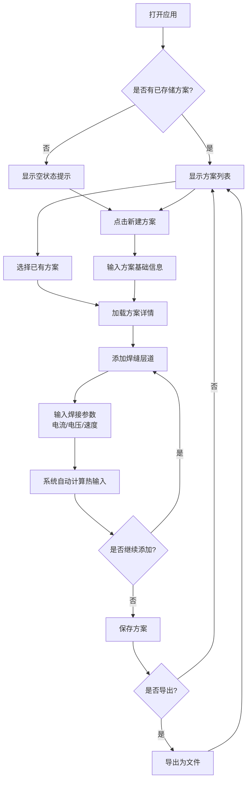

# 焊接工艺评定试件记录系统 - 产品需求文档

## 1. 产品概述
这是一款专为焊接工艺评定设计的多层多道焊参数记录应用，帮助焊接工程师和技术人员精准记录每道焊接的电流、电压、速度等关键参数，并自动计算热输入，支持多个焊接工艺评定方案的存储和管理。

**核心价值：**
- 提高焊接工艺评定记录的准确性和效率
- 自动计算热输入，减少人工计算错误
- 支持多个工艺评定方案的对比和管理

## 2. 核心功能

### 2.1 用户角色
| 角色 | 核心权限 |
|------|----------|
| 焊接工程师 | 创建、编辑、查看和删除焊接工艺评定记录 |

### 2.2 功能模块
1. **工艺评定列表页**：展示所有焊接工艺评定方案，支持创建新方案
2. **参数记录详情页**：记录多层多道焊参数，自动计算热输入
3. **数据管理**：本地存储、导入导出功能

### 2.3 页面详情
| 页面名称 | 模块名称 | 功能描述 |
|----------|----------|----------|
| 工艺评定列表页 | 方案列表卡片 | 显示每个工艺评定的基本信息、焊缝数量、创建时间等 |
| | 新建方案按钮 | 创建新的焊接工艺评定方案 |
| | 搜索过滤 | 按名称或编号搜索工艺评定方案 |
| 参数记录详情页 | 基础信息区 | 显示工艺评定编号、项目名称、材料信息等 |
| | 层道参数表 | 多层多道焊的参数输入表格（电流、电压、速度） |
| | 热输入计算 | 自动计算并显示每道的热输入值 |
| | 参数统计 | 显示总体统计信息（平均热输入、参数范围等） |
| | 保存导出 | 保存数据并支持导出为Excel或PDF |

## 3. 核心流程

用户打开应用后，可以创建新的焊接工艺评定方案或选择已有方案进行编辑。在详情页中，用户逐层逐道输入焊接参数，系统实时计算热输入并展示统计数据。完成后可保存到本地存储，并可随时导出记录。

## 4. 用户界面设计

### 4.1 设计风格
- **主色调**：工业蓝灰色系（#2D3E50深蓝灰 + #4A90E2科技蓝）体现焊接行业的专业性和技术感
- **辅助色**：橙红色（#E67E22）用于强调和警示，呼应焊接火焰的颜色
- **按钮风格**：略微圆角的实心按钮，带有细微的阴影效果
- **字体**：使用中文字体"思源黑体"或系统默认黑体，数字使用"Roboto Mono"等宽字体便于对齐
- **布局风格**：卡片式布局，顶部导航，清晰的视觉层次
- **图标风格**：线条图标，配合工业风格的简约设计

### 4.2 页面设计概览
| 页面名称 | 模块名称 | UI元素 |
|----------|----------|--------|
| 工艺评定列表页 | 方案列表卡片 | 圆角卡片，左侧显示编号，右侧显示基本信息和操作按钮，悬停时有轻微上浮效果 |
| | 新建方案按钮 | 页面右上角的醒目按钮，橙色背景，带有"+"图标 |
| 参数记录详情页 | 参数输入表格 | 清晰的表格布局，每行显示层号、道号，输入框使用等宽字体，实时显示计算结果 |
| | 热输入显示 | 计算结果使用蓝色高亮显示，带有单位"W/mm" |
| | 统计面板 | 右侧或底部固定面板，显示总体统计信息 |

### 4.3 响应式设计
- 采用桌面优先设计，主要在PC端使用
- 最小支持1024px宽度，表格在移动端可横向滚动
- 触屏设备优化：输入框和按钮的最小点击区域为44x44px

### 4.4 动画效果
- 页面切换：淡入淡出效果（300ms）
- 卡片悬停：轻微上浮和阴影加深（200ms）
- 按钮点击：按压反馈效果（100ms）
- 计算结果更新：数字滚动动画
- 新增层道：从下方滑入动画（200ms）