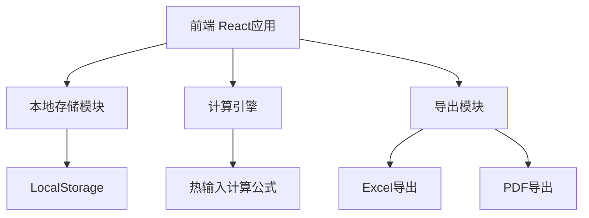
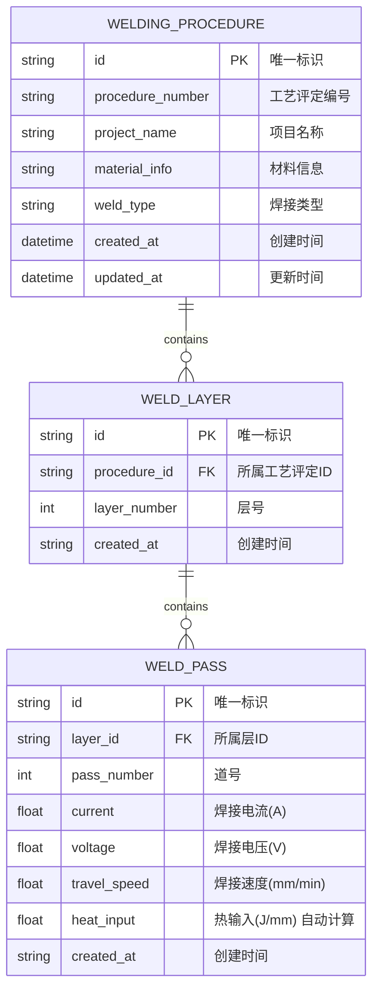

# 焊接工艺评定试件记录系统 - 技术架构文档

## 1. 架构设计



## 2. 技术说明

### 2.1 技术栈
- **前端框架**: React 18 + TypeScript
- **样式方案**: Tailwind CSS 3
- **构建工具**: Vite
- **状态管理**: React Context + useReducer
- **本地存储**: LocalStorage API
- **导出功能**: xlsx (Excel导出) + html2canvas + jspdf (PDF导出)
- **图标**: Lucide React

### 2.2 核心计算公式
**热输入计算公式**:
```
热输入 (J/mm) = (电流 × 电压 × 60) / 焊接速度
```
其中：
- 电流单位：安培 (A)
- 电压单位：伏特 (V)
- 焊接速度单位：毫米/分钟 (mm/min)
- 热输入单位：焦耳/毫米 (J/mm)

## 3. 路由定义

| 路由 | 目的 |
|------|------|
| `/` | 工艺评定列表页，显示所有方案 |
| `/procedure/:id` | 参数记录详情页，编辑具体工艺评定参数 |
| `/procedure/new` | 创建新的工艺评定方案 |

## 4. 数据模型

### 4.1 数据模型定义



### 4.2 数据定义语言

```typescript
// 焊接工艺评定方案
interface WeldingProcedure {
  id: string;
  procedureNumber: string;
  projectName: string;
  materialInfo: string;
  weldType: string;
  createdAt: string;
  updatedAt: string;
}

// 焊接层
interface WeldLayer {
  id: string;
  procedureId: string;
  layerNumber: number;
  passes: WeldPass[];
  createdAt: string;
}

// 焊接道次
interface WeldPass {
  id: string;
  layerId: string;
  passNumber: number;
  current: number;          // 焊接电流(A)
  voltage: number;          // 焊接电压(V)
  travelSpeed: number;      // 焊接速度(mm/min)
  heatInput: number;        // 热输入(J/mm) - 自动计算
  createdAt: string;
}
```

## 5. API设计（本地存储）

由于应用采用本地存储方案，所有数据操作通过封装的存储API进行：

### 5.1 存储模块接口

```typescript
// 存储服务接口
interface StorageService {
  // 工艺评定操作
  getAllProcedures(): Promise<WeldingProcedure[]>;
  getProcedureById(id: string): Promise<WeldingProcedure | null>;
  createProcedure(data: Omit<WeldingProcedure, 'id' | 'createdAt' | 'updatedAt'>): Promise<WeldingProcedure>;
  updateProcedure(id: string, data: Partial<WeldingProcedure>): Promise<WeldingProcedure>;
  deleteProcedure(id: string): Promise<void>;
  
  // 焊接层道操作
  getLayersByProcedureId(procedureId: string): Promise<WeldLayer[]>;
  createLayer(procedureId: string, layerNumber: number): Promise<WeldLayer>;
  deleteLayer(layerId: string): Promise<void>;
  
  // 焊接道次操作
  createPass(layerId: string, data: Omit<WeldPass, 'id' | 'layerId' | 'heatInput' | 'createdAt'>): Promise<WeldPass>;
  updatePass(passId: string, data: Partial<WeldPass>): Promise<WeldPass>;
  deletePass(passId: string): Promise<void>;
}

// 热输入计算函数
function calculateHeatInput(current: number, voltage: number, travelSpeed: number): number {
  // 公式: 热输入 = (电流 × 电压 × 60) / 焊接速度
  return (current * voltage * 60) / travelSpeed;
}
```

## 6. 项目结构

```
/src
  /components
    /common          # 通用组件
    /procedure       # 工艺评定相关组件
  /pages
    ProcedureList    # 列表页
    ProcedureDetail  # 详情页
  /hooks             # 自定义Hooks
  /utils
    calculation.ts   # 计算相关工具函数
    storage.ts       # 本地存储封装
    export.ts        # 导出功能
  /types             # TypeScript类型定义
  /context           # React Context
```

## 7. 关键技术实现

### 7.1 实时计算
使用React的useEffect监听输入参数变化，实时计算热输入：

```typescript
useEffect(() => {
  if (current && voltage && travelSpeed && travelSpeed > 0) {
    const heatInput = calculateHeatInput(current, voltage, travelSpeed);
    setHeatInput(heatInput);
  }
}, [current, voltage, travelSpeed]);
```

### 7.2 本地存储策略
- 使用LocalStorage存储所有数据
- 数据以JSON格式存储
- 提供数据备份和恢复功能
- 存储键名: `welding_procedures`

### 7.3 导出功能
- Excel导出: 使用xlsx库生成格式化的Excel文件
- PDF导出: 使用html2canvas截取页面，再通过jspdf生成PDF